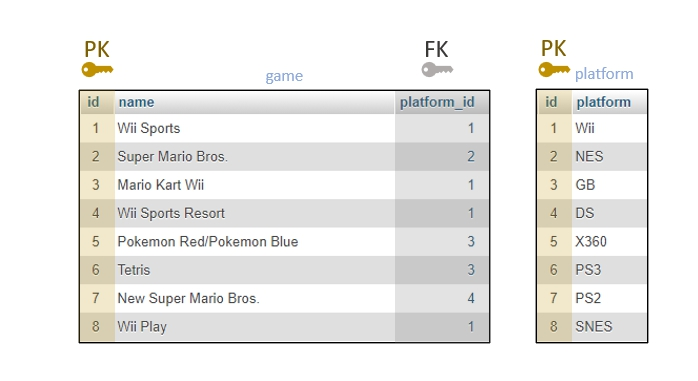

# MYSQL-ADVANCED-RELATIES-TAAK-02

## Relaties tussen database-tabellen

## Uitleg

In de vorige taak hebben we gezien hoe de database server kan zien welke rijen uit verschillende tabellen bij elkaar horen. Dit gebeurt door het vergelijken van de inhoud van 2 kolommen; een in ieder van de twee tabellen die een relatie met elkaar hebben. Maar hoe geef je nu aan in een database welke kolommen met elkaar vergeleken moeten worden?

### Primary Key en Foreign Key

Dit doe je door in elke tabel bepaalde kolommen in te stellen als *sleutel* kolom. Je bent al bekend met de term Primary Key. Een Primary Key maakt een rij in een tabel uniek. 

In onderstaand plaatje staat aangegeven wat de primary en foreign key kolommen zijn in onze nieuwe database.

> Primary Key en Foreign Key
> 
> Een **Primary Key** is een unieke waarde die ervoor zorgt dat een rij in de database uniek is. 
> 
> Een **Foreign Key** is niet uniek maar wordt gebruikt om te verwijzen naar een primary key in een andere tabel.
> 
Terug naar de relatie die er nu bestaat tussen de twee tabellen. Deze is schematisch in een ERD weergegeven in onderstaand plaatje.

Bovenstaand plaatje in een screenshot uit de PhpMyAdmin Designer view. 

De groene verbinding geeft de relatie weer tussen de twee tabellen. De verbinding loopt van de `platform.id` kolom naar de `game.platform_id` kolom.

Een relatie bestaat altijd tussen **twee** tabellen, nooit *meer* of *minder*. Er zijn 3 soorten relaties, in dit geval gaat het om een `One to Many` relatie. Als je dit moet verwoorden dan zou je kunnen zeggen dat: 

> elke game in de `game` tabel één platform heeft en dat elk platform in de `platform` tabel meerdere games heeft. 
 
Je kunt misschien uitzonderingen hierop bedenken, er zijn tenslotte games die op meerdere platformen zijn uitgebracht. Het zou daarom exacter zijn om te zeggen dat:

> elke rij in de `game` tabel matched met 1 (One) rij in de `platform` tabel en dat elke rij in de `platform` tabel matched met meerdere (Many) rijen in de `game` tabel. 

### Hoe snapt MySQL welke gegevens bij elkaar horen?

 

## Leerdoelen

1. Ik weet wat het begrip foreign key betekent
2. Ik weet hoe een relaties worden gemaakt tussen tabellen
3. Ik ken de verschillen tussen primary- en foreign keys
4. Ik begrijp waarom het gebruik van een foreign key in een tabel nuttig is

## Opdracht

## Bronnen

