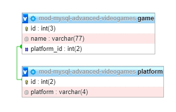

# MYSQL-ADVANCED-RELATIES-TAAK-02

## Relaties tussen database-tabellen

## Uitleg

In de vorige taak hebben we uitgerekend hoeveel het *ongeveer* scheelt als we dubbele data vermijden in onze database. In werkelijkheid is de manier waarop databases gegevens opslaan iets complexer dan dat er bij de vorige taak wordt beschreven en verschilt dit ook per database systeem.

### Oplossing dubbele data

Om het probleem van de dubbele data op te lossen ontwerpen we de database met twee tabellen in plaats van één. Hoe dat eruit ziet zie in je in onderstaand plaatje.

We gaan dus van één tabel met 3 kolommen naar twee tabellen met in totaal 5 kolommen. In bovenstaand plaatje zie dat er twee nieuwe kolommen bij zijn gekomen: `platform_id` in de `game` tabel en `id` in de `platform` tabel. Deze kolommen gebruiken we om de relatie tussen de twee tabellen vast te leggen.

> EXTRA: Wat levert dit dan op? Uiteindelijk houden we dus twee tabellen over: de `game` tabel met 16719 rijen en de `platform` tabel met (maar!) 31 rijen. In dit voorbeeld is de ruimtebesparing niet heel groot: je vervangt de `game.platform` kolom die wordt opgeslagen als een varchar(4) door de `game.platform_id` kolom die wordt opgeslagen als een int(2). Voor 16719 rijen scheelt dit 1 byte per rij dus in totaal 16719 rijen = 16,7 kb. Je bent echter nog wel wat ruimte kwijt voor de nieuwe `platform` tabel: 31 rijen * 4 bytes voor de `id` kolom en 31 rijden * 4 bytes voor de `platform` kolom is gelijk aan 248 bytes. Totale besparing in deze (heel ruwe) berekening is dus 16719-248= 16471 bytes = 16,5 kilobytes afgerond. Niet heel veel maar je kun je voorstellen dat dit bij een grotere database wel degelijk veel uitmaakt.

### Relaties

Terug naar de relatie die er nu bestaat tussen de twee tabellen. Deze is schematisch in een ERD weergegeven in onderstaand plaatje.

Bovenstaand plaatje in een screenshot uit de PhpMyAdmin Designer view. 

De groene verbinding geeft de relatie weer tussen de twee tabellen. De verbinding loopt van de `platform.id` kolom naar de `game.platform_id` kolom.

Een relatie bestaat altijd tussen **twee** tabellen, nooit *meer* of *minder*. Er zijn 3 soorten relaties, in dit geval gaat het om een `One to Many` relatie. Als je dit moet verwoorden dan zou je kunnen zeggen dat: 

> elke game in de `game` tabel één platform heeft en dat elk platform in de `platform` tabel meerdere games heeft. 
 
Je kunt misschien uitzonderingen hierop bedenken, er zijn tenslotte games die op meerdere platformen zijn uitgebracht. Het zou daarom exacter zijn om te zeggen dat:

> elke rij in de `game` tabel matched met 1 (One) rij in de `platform` tabel en dat elke rij in de `platform` tabel matched met meerdere (Many) rijen in de `game` tabel. 

### Hoe snapt MySQL welke gegevens bij elkaar horen?

Om dit uit te leggen

In onderstaand plaatje staat aangegeven wat de primary en foreign key kolommen zijn in onze nieuwe database.

> Primary Key en Foreign Key
> 
> Een **Primary Key** is een unieke waarde die ervoor zorgt dat een rij in de database uniek is. 
> 
> Een **Foreign Key** is niet uniek maar wordt gebruikt om te verwijzen naar een primary key in een andere tabel.

 

## Leerdoelen

1. Ik weet wat het begrip foreign key betekent
2. Ik weet hoe een relaties worden gemaakt tussen tabellen
3. Ik ken de verschillen tussen primary- en foreign keys
4. Ik begrijp waarom het gebruik van een foreign key in een tabel nuttig is

## Opdracht

## Bronnen

