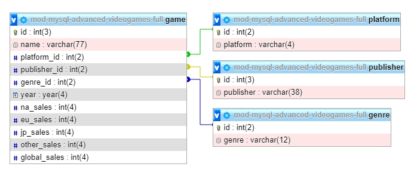

# MYSQL-ADVANCED-RELATIES-TAAK-06

## Uitleg

Tot nu toe hebben we gezien hoe je in een database met 2 tabellen gegevens uit die tabellen samengevoegd kan terug krijgen door een SQL query met een JOIN clausule te schrijven.

Maar wat als je gegevens uit meer dan 2 tabellen wilt samenvoegen? We gaan gebruik maken van weer een nieuwe database waarin nu behalve de `platform` kolom uit de originele `videogamesales` database ook de `genre` en `publisher` kolommen naar een eigen tabel zijn verplaatst.

Zie hieronder voor de ERD:



Stel nu dat je een overzicht wilt maken alle games die beginnen met de letter "a" met het platform en het genre van die games? Dit kan met één enkele SQL query:
```sql
SELECT game.name, platform.platform, genre.genre FROM game
LEFT JOIN platform ON game.platform_id = platform.id
LEFT JOIN genre ON game.genre_id = genre.id
WHERE game.name LIKE "a%";
```
Voor de leesbaarheid is de SQL query onderverdeeld in meerdere regels. Die kun je zelf ook doen in SQL tab in PhpMyAdmin, de query is pas afgesloten als je dit aangeeft met een `;`


## Leerdoelen

1. Ik kan meerdere JOIN clausules toevoegen aan een SQL query en deze uitvoeren

## Voorbereiding

In de `db-export` map staat weer een database export klaar. Importeer deze in een nieuw aangemaakte database genaamd `mod-mysql-advanced-videogames-full` en voer de onderstaande opdrachten uit.

## Opdracht

1. Maak een overzicht van de naam, het platform en het genre van alle games die beginnen met de letter `b`.
2. Maak een overzicht van de naam, het platform en de publisher van alle spellen die zijn uitgekomen in 2013. Zorg ervoor dat de laatste kolom ook nog het jaar laat zien.
3. Maak een overzicht van alle spellen die zijn uitgekomen in het `Puzzle` genre na het jaar 2000. Toon de naam, het genre, het jaar en het aantal verkopen wereldwijd.
4. Maak een overzicht met alle spellen die beginnen met `Mario` waarin je het platform, het jaar van uitgave, het genre, de publisher en het aantal verkopen in Japan laat zien.
5. Maak een overzicht van alle spellen die zijn uitgekomen voor het `PC` platform waarin je de naam laat zien, het genre, de publisher en het jaar van uitgave.

## Bronnen
[W#Schools SQL Joins](https://www.w3schools.com/sql/sql_join.asp)
[W3Schools - SQL LIKE Operator](https://www.w3schools.com/SQL/sql_like.asp)